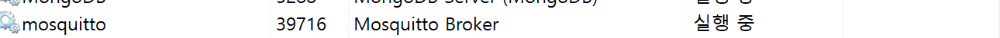
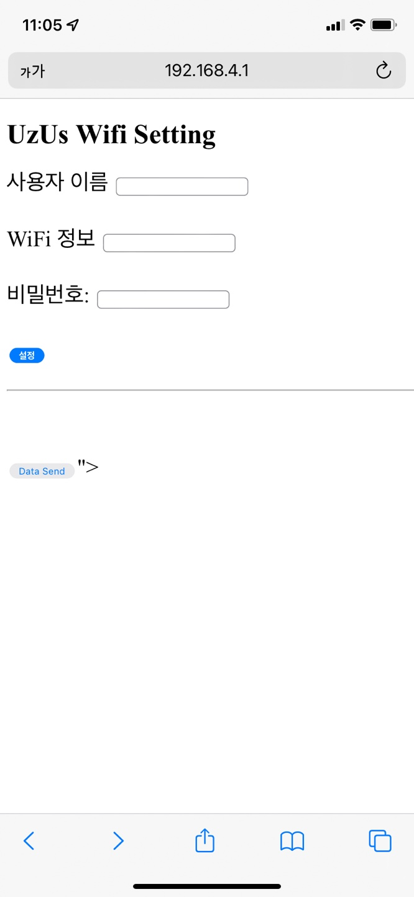

# UZUS 텀블러 세척기 Tumbling

     
     

다회용기 사용을 재미로

 

## UZUS 텀블러 세척기(Tumbling)
편리한 다회용기 사용문화를 만들기 위한 텀블러 세척기 개발
1. 편리한 텀블러 세척으로 텀블러 사용문화 형성
2. ESG 경영 보고서를 위한 환경데이터 데시보드 제공

## 설명
wifi 통신이 가능한 esp32 보드를 이용하여 서버와 통신 
적외선 센서를 통해 사람의 동작을 감지하고, 센서데이터 신호를 mqtt 통신을 이용하여 서버(로컬)로 보냄 
적외선 센서에 동작이 감지되면 릴레이 센서, led on --> 세척 1회 서버로 전송

## 개발 언어
C, CMake, C++

## 개발 환경 설정
.DEVICE 
　　├─main 
　　└─README.md 
　　　　├─main 
　　　　├─CMakeLists.txt 
　　　　├─Makefile 
　　　　├─README.md 
　　　　├─partitions.csv 
　　　　└─sdkconfig 
　　　　　　├─main 
　　　　　　├─inc 
　　　　　　├─src 
　　　　　　├─main.c 
　　　　　　├─CMakeLists.txt 
　　　　　　└─component.mk 
<pre>
1. Git clone
2. 하위 main Folder에서 inc, src Folder 복사
3. 작업할 Folder에 복사
4. 하위 main Folder 내 CMakeListt.txt 복사
</pre>
## Environment Setting
#### sdkconfig 내 값 수정 필요
<pre>
CONFIG_HTTPD_MAX_REQ_HDR_LEN 
</pre>
HTTP Header Size로, 기존 512에서 2048로 변경
<pre>
# CONFIG_PARTITION_TABLE_SINGLE_APP is not set
# CONFIG_PARTITION_TABLE_TWO_OTA is not set
CONFIG_PARTITION_TABLE_CUSTOM=y
CONFIG_PARTITION_TABLE_CUSTOM_FILENAME="partitions.csv"
CONFIG_PARTITION_TABLE_FILENAME="partitions.csv"
CONFIG_PARTITION_TABLE_OFFSET=0x8000
CONFIG_PARTITION_TABLE_MD5=y
# end of Partition Table
</pre>
Partion Setting 변경

## Build and Flash
<pre>
idf.py build
</pre>
code build 명령어로, build 후 flash 작업 가능 (target에 연결되어 있지 않아도 가능)
 
<pre>
idf.py flash
</pre>
flash 명령어로, 자동 build - flash 명령어 (target 연결 및 COM Port 확인 필요)
<pre>
idf.py monitor
</pre>
flash 후 target 동작 monitoring 명령어 (로그 및 동작 오류 확인 등)
 
 
## MQTT Setting
<ol>
<li>ipconfig로 PC IP 확인</li>
<li>Device 코드 내 MQTT Address를 PC IP로 설정</li>
<li>Server 코드 내 MQTT Address를 PC IP로 설정</li>
<li>C:\Program Files\mosquitto Folder에서 mosquitto.conf 관리자 권한으로 실행 (Windows 기준)</li>
<li>File 하단에 
 
bind_address xxx.xxx.xx.xx  (PC IP)
 
allow_anonymous true 
 
추가 후 저장</li>

<li>MQTT Broker Service 시작(작업관리자 - 서비스 - mosquitto 실행)</li>
</ol>

## 방화벽 설정
#### 인바운드 규칙에 1883 포트 추가(MQTT DISCONNECT시에)
<ol>
<li>윈도우 검색에서 '방화벽 상태 확인' 검색 -> 고급 설정 -> 인바운드 규칙</li>
<li>새 규칙 -> 포트 체크 후 '다음' -> '1883' 포트 추가</li>
 </ol>

 ## Wifi Setting
 
<ol>
<li>WiFi 검색 후 UzUs 클릭</li>
<li>비밀번호 입력(초기 비밀번호 : 11122233344455)</li>
<li>WiFI 연결 후 크롬 실행</li>
<li>URL 192.168.4.1 접속</li>
<li>Inputbox에 연결할 Wifi 및 비밀번호 입력</li>
</ol>
<pre>
하위 main 폴더 내의 src 폴더의 wifi.c 파일에서 249~262번 라인 주석 필수
</pre>

